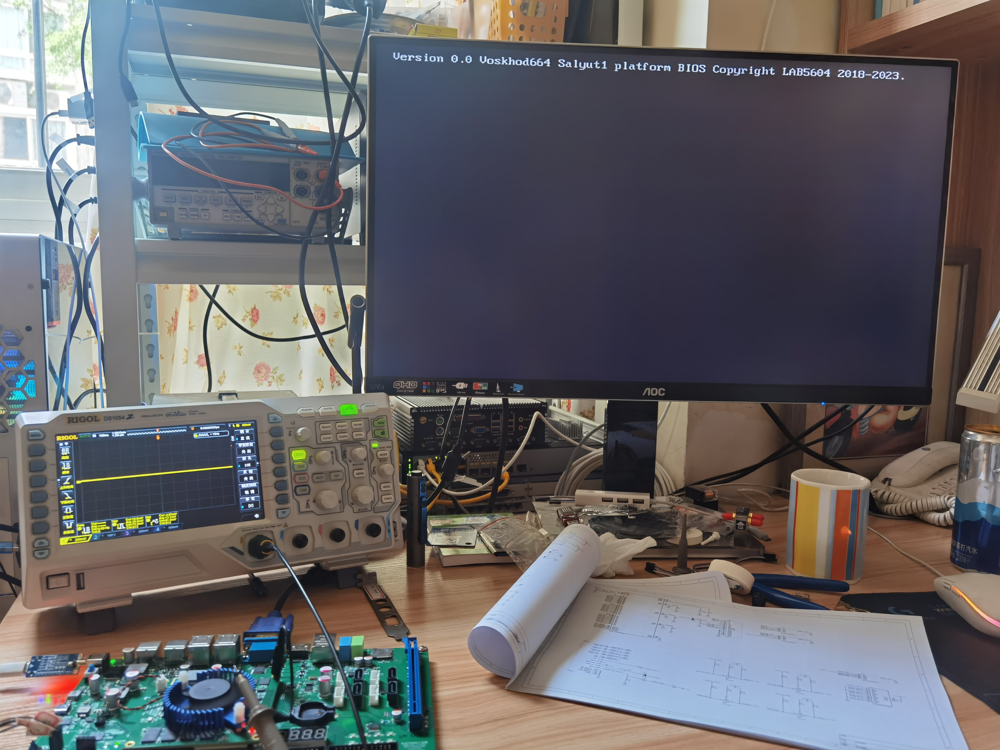

# Voskhod664


#### Introduction
Voskhod664 is team RV-AT's 6th generation RISC-V Core.
Targeted an RV64GV dual-issue in order processor, can boot Linux based system.

This project also build a simple soc called "Salyut-1" which have UART, VGA controller, Timer and DDR Controller,
this SoC now can running on "E4FPM7K325 MMB" FPGA board designed by LAB5604 studio!

ATTENTION: You SHOULD use Linux/Unix-based system to do development for this project
           Windows with modelsim is also OK

voskhod664处理器及其demo SoC已经在Lab5604 xc7k325t开发板上点亮，下图为其bios界面和其集成彩色字符显卡驱动程序测试：



#### Code Structure

```
├─board         #适配相应板卡的文件
│  └─xilinx
│          e4fpmk7_mmb.v        #e4fpm7k325板卡顶层文件
│          prv664_config.sv     #cpu配置，在综合的时候使用此config文件
│          salyut1_soc_config.svh#soc配置，在综合的时候使用此config文件
│
├─core                          #voskhod664 cpu core
│  │  prv664_bus_define.sv
│  │  prv664_config.sv
│  │  prv664_define.sv
│  │  prv664_fpu_wrapper.sv
│  │  prv664_top.sv
│  │  prv664_top_top.sv
│  │  riscv_define.sv
│  │
│  ├─cache
│  │      amo_unit.v
│  │      biu.sv
│  │      cacheram.v
│  │      cache_top.sv
│  │      data_shift_l.v
│  │      data_shift_r.v
│  │      icache_top.sv
│  │      refersh_reload_ctrl.sv    #
│  │
│  ├─fpu                            #TBD
│  ├─interface                      #core用的所有interface文件都在这里，Salyut1也用了bus interface里面的一些内容
│  │      prv664_bus_interface.sv
│  │      prv664_commit_interface.sv
│  │      prv664_commit_interface.sv.bak
│  │      prv664_debug_interface.sv
│  │      prv664_decode_interface.sv
│  │      prv664_execute_interface.sv
│  │      prv664_execute_interface.sv.bak
│  │      prv664_interface.sv
│  │      prv664_interface.sv.bak
│  │      prv664_test_interface.sv
│  │
│  └─pipline                        #core流水线
│      │  prv664_pipline_top.sv
│      │  rob_core.sv
│      │
│      ├─commit
│      │      commit_input_manage.sv
│      │      commit_input_manage.sv.bak
│      │      prv664_commit.sv
│      │      prv664_flush_manage.sv
│      │      trap_manage.sv
│      │
│      ├─csr
│      │      counters.sv
│      │      csr_top.sv
│      │      fpcsr.sv
│      │      hart_debug.sv
│      │      inform.sv
│      │      trap_handle.sv
│      │      trap_setup.sv
│      │      virtual_trans.sv
│      │
│      ├─decode
│      │      decode.sv
│      │      decode.sv.bak
│      │      decode_input_manage.sv
│      │      decode_output_manage.sv
│      │      deocde_input_manage.sv.bak
│      │      prv664_decode.sv
│      │      prv664_decode.sv.bak
│      │      prv664_regfile.sv.bak
│      │
│      ├─dispatch
│      │      dispatch_input_manage.sv
│      │      dispatch_input_manage.sv.bak
│      │      prv664_dispatch.sv
│      │      prv664_dispatch.sv.bak
│      │      prv664_fscoreboard.sv
│      │      prv664_iscoreboard.sv
│      │      prv664_regfile.sv
│      │
│      ├─execute
│      │  │  alu.sv
│      │  │  alu.sv.bak
│      │  │  bru.sv
│      │  │  bypass.sv
│      │  │  fpu
│      │  │  lsu.sv
│      │  │  sysmanage.sv
│      │  │
│      │  └─mdiv
│      │          Booth_Multiplier_4xA.v
│      │          hp_int_div.v
│      │          mdiv.sv
│      │          mdiv.sv.bak
│      │          MulCyc_Div.v
│      │
│      ├─instr_front
│      │      bpu.sv
│      │      btb.sv
│      │      pht.sv
│      │      prv664_instr_front.sv
│      │      ras.v
│      │
│      ├─mmu
│      │      pagecheck.sv
│      │      prv664_mmu.sv
│      │      ptw.sv
│      │      tlb.sv
│      │      tlb_top.sv
│      │
│      ├─rob
│      │      prv664_rob.sv
│      │      prv664_rob.sv.bak
│      │
│      └─writeback
│              prv664_writeback.sv
│
├─misc                      #一些基础模块，当适配FPGA板卡时可能需要修改其中模块的内容
│  │  fifo1r1w.v
│  │  README.md
│  │  spsram.v
│  │  sram_1r1w.v
│  │  sram_1r1w_async_read.v
│  │  sram_1r1w_async_read.v.bak
│  │  sram_1rw_async_read.v
│  │  sram_1rw_sync_read.v
│  │
│  └─bsc_lib                #bsc verilog综合器用到的库
│          FIFO2.v
│          FIFOL1.v
│
├─NOUSE                     #不再使用的文件，如果一个模块没有被使用，但是不确定是否真的不需要，将会被移入此文件夹
│  │  fakecache.sv
│  │  sram_1rw.v
│  │  sram_2rw.v
│  │
│  └─ocram
│          apb_sramc.v
│          axi4_ocram_top.sv
│          axi4_ocram_top.sv.bak
│
├─sim
│  │  axi_ram_sim.sv
│  │  fullsoc_tb.sv
│  │  ras_tb.v
│  │  virtual_bus.sv
│  │  voskhod664_simtop.sv
│  │
│  ├─cache_difftest
│  │      axi_ram.v
│  │      cache_difftest.sv
│  │
│  ├─icache_difftest
│  │      axi_ram.v
│  │      icache_difftest.sv
│  │
│  └─ref
│          fullv_difftest.sv
│          riscv_define.v
│          virtual_rv.v
│
└─soc
    │  axi_ram.v
    │  mkaxi64apb32_bridge.v
    │  mkaxi64apb8_bridge.v
    │  reset_gen.v
    │  salyut1_soc_config.svh
    │  salyut1_soc_top.sv
    │
    ├─apb_cluster
    │  │  apb_busmux.v
    │  │  apb_cluster_top.v
    │  │
    │  ├─text_vga
    │  │  │  blink_generator.v
    │  │  │  blink_ram.v
    │  │  │  blink_ram.v.bak
    │  │  │  char_ram.v
    │  │  │  char_ram.v.bak
    │  │  │  char_row_counter.v
    │  │  │  check_display.v
    │  │  │  check_horiz_sync.v
    │  │  │  check_vert_sync.v
    │  │  │  color_pallette1.v
    │  │  │  color_pallette2.v
    │  │  │  color_pallette3.v
    │  │  │  color_pallette4.v
    │  │  │  glyph_rom.v
    │  │  │  horiz_counter.v
    │  │  │  pallette_controller.v
    │  │  │  textvga_top.v
    │  │  │  vert_counter.v
    │  │  │  vga_controller.v
    │  │  │  wb_textvga_top.v
    │  │  │  wb_textvga_top.v.bak
    │  │  │
    │  │  └─rom
    │  │          blink.txt
    │  │          char.txt
    │  │          color.txt
    │  │          font.txt
    │  │
    │  └─uart16550
    │          raminfr.v
    │          timescale.v
    │          uart_debug_if.v
    │          uart_defines.v
    │          uart_receiver.v
    │          uart_regs.v
    │          uart_rfifo.v
    │          uart_sync_flops.v
    │          uart_tfifo.v
    │          uart_top.v
    │          uart_transmitter.v
    │          uart_wb.v
    │
    ├─axil_cluster
    │      axil_reg_if.v
    │      axil_reg_if_rd.v
    │      axil_reg_if_wr.v
    │      axil_xlic.v
    │      axi_axil_adapter.v
    │      axi_axil_adapter_rd.v
    │      axi_axil_adapter_wr.v
    │
    └─axi_xbar
            axicb_checker.sv
            axicb_crossbar_lite_top.sv
            axicb_crossbar_top.sv
            axicb_mst_if.sv
            axicb_mst_switch.sv
            axicb_pipeline.sv
            axicb_round_robin.sv
            axicb_round_robin_core.sv
            axicb_scfifo.sv
            axicb_scfifo_ram.sv
            axicb_slv_if.sv
            axicb_slv_switch.sv
            axicb_switch_top.sv
```
#### Simulation
见./doc/voskhod664UserManual

#### Usage

voskhod664 cpu提供一个demo soc：salyut-1作为cpu的参考实现。

#### 参与贡献

欢迎任何人加入这个开源SoC项目！


