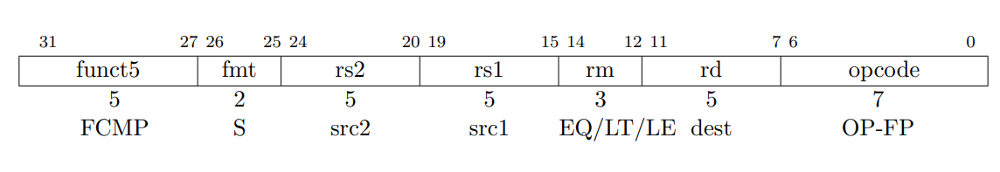

 # 架构参考手册
 在阅读这篇markdown之前，请先安装markdown“mermaid”拓展以获得最佳预览效果。

 与PRV564设计理念上的不同之处：
 1. 将debug单元作为预先考虑的一部分嵌入到流水线中。
 2. 将大部分资源都进行BRAM优化，适应FPGA。
 ## 代码特点
PRV664大量采用interface来节约代码行数，综合时应选择支持systemverilog interface的综合器。重要的模块里都嵌入了assert语句来辅助判定错误。

### 文件结构
./src/core：prv664核心部分的verilog代码

./src/misc：核心和demo soc使用的一些基础库文件，fifo、sram等，在进行asic或者fpga适配时只需修改misc中的基础库文件即可完成适配。其中的文件均可在不额外修改的情况下被fpga综合工具自动识别成ip。

./src/soc：使用prv664核心的示例soc，使用简单的外设，有vga字符卡。

 ## 整体架构

 ```mermaid
 graph TD
  subgraph IFU
    bpu
    fetch_buffer
  end
  fetch_buffer-->decode0
  fetch_buffer-->decode1
  subgraph IDU
    decode0
    decode1
  end
  decode0-->rob
  decode1-->rob
  decode0-->dispatch
  decode1-->dispatch
  scoreboard-->dispatch
  regfile-->dispatch
  subgraph DU
    dispatch
  end
  dispatch-->sysmanage
  dispatch-->bru
  dispatch-->alu0
  dispatch-->alu1
  dispatch-->mdiv
  dispatch-->fpu
  dispatch-->lsu
  subgraph EXU
    sysmanage
    bru
    alu0
    alu1
    mdiv
    fpu
    lsu
  end
  subgraph WB
    rob
  end
  sysmanage-->rob
  bru-->rob
  alu0-->rob
  alu1-->rob
  mdiv-->rob
  fpu-->rob
  lsu-->rob
  subgraph CMT
    commit
  end
  rob-->commit
  commit-->scoreboard
  commit-->regfile
    
 ```
### 流水线
prv664使用变长流水线结构，不同的指令有不同的执行路径：
|STAGE|1|2|3|4|5|6|7|8|9|10|
|--|--|--|--|--|--|--|--|--|--|--|
|整数指令|PC|ITLB|ICACHE|IDU|DP|EX|WB|CMT|
|存取指令|PC|ITLB|ICACHE|IDU|DP|AG|DTLB|DCache|WB|CMT|

## 在开始这篇文章前
**如果你目前只是需要使用这个soc/cpu，请移步“voskhod664UserManual”**

一些提示：
1. 这个处理器是不是超标量？它确实很慢，但是在FPGA上资源占用才40K LUT4左右，并且最快的时候能一次提交两条指令。
2. commit（提交）和write-back（写回）是不一样的，write-back指的是从流水线执行单元写回rob，此时指令是等待提交状态；commit指的是指令从rob中提交并最终生效。
3. 架构中的很多地方都针对现实中的器件特点做了取舍，例如能使用1r1w存储器的情况下就尽量使用1r1w的存储器，这样会在fpga上取得不错的资源占用表现。
4. 如果作者不是一个人在开发的话，肯定不会只做这么多。

本篇技术参考手册将以指令在流水线中执行的过程为线索，依次阐述每个模块的功能。
 
 ## 指令MMU（I-MMU）

 mmu interface中定义了opcode和function来管理MMU的功能，但是指令MMU并不需要执行更多复杂的操作，只需要根据几个简单的命令即可工作：
  |opcode|function| 功能 |
 |------|----|-----|
 | LOAD |x|转换VA地址到PA|


 MMU被设计成直接与cache相连：
 ```mermaid
 
 graph LR
 I-TLB--Cache interface-->L1I
 ```

MMU有三个工作状态：RUN、LOAD、FLUSH。
1. RUN状态：可以正常处理访问，如果TLB miss时进入LOAD状态，当FLUSH请求使能时进入FLUSH状态。
2. LOAD状态：当前的访问没有在TLB中查到表项，PTW根据当前访问的VPN（虚拟页号）查询页表，并装填TLB。
3. FLUSH状态：刷新TLB页表，一个周期即可完成。
 
 ### I-TLB
 I-TLB为直接映射的地址映射查询快表，根据riscv sv39分页方案的定义，一共有3种页面大小：4K、2M、1G，可以通过"prv664_config.svh"来配置三种TLB的大小。
 ### I-PTW
Sv39分页方案为硬件查询页表，在TLB miss发生后，MMU模块状态切换为装填（Reload）模式，PTW此时可以使用TLB的写接口写入新的页表。
 ## 指令缓存（I-Cache）
 ### 命令
 cache interface中定义了opcode和function来管理功能，但指令cache只需要根据opcode中几条简单的opcode即可工作，无须function段来控制其进行更复杂的行为，使其实现最简单化。
 
 指令缓存的详细功能需求见“cache document”

 |opcode|function| 功能 |
 |------|----|-----|
 | LOAD |x|从内存中读取对齐的128位值|


 ## 指令前端（instruction front）
 ### 概览
 在./core/pipline/instr_front文件夹中存放了prv664指令前端包含的verilog文件。指令前端包含下面interface：

| 接口    |   描述   |
| ------  | ------   |
| tlbinterface_mif | 向tlb发送访问请求的接口 |
| cacheinterface_result | 从cache中收回执的接口 |
| btbupd_slave | 更新btb的接口 |
| phtupd_slave | 更新pht的接口 |
| pip_ifu_mif | 传递到下一级流水线的接口 |
| flush_slave | 从后级送到前面的刷新信号 |

此外，还有clk和reset信号

指令前端的作用是：

1. 生成pc，对pc进行预测，确定下一条指令的pc。
2. 产生访问信号，通过tlbinterface_mif送出。
3. 接收访问返回的数据，存放到内部的buffer中。

prv664的指令前端主要分为两部分：bp、arob，bp部分主要负责预测pc，产生一个fetch group中有效的字；arob的作用是记录派遣出去的访问，给派遣出去的访问分配一个buffer，确保在cache有返回值的时候可以立刻接收。

指令前端与存储器的连接关系如下图所示：


### 分支预测单元（bpu）
BPU的作用是：
1. 读取当前PC，产生PC_NEXT。
2. 读取当前PC，预测下一条指令，产生Validword。
3. 接收分支预测表的更新。


### arob

Access Re-Order Buffer，简称arob，用于管理派遣出去的访问的顺序，确保访问结果到达下一级时是按序的，arob中每一项的内容如表：

| 域 | 功能 |
|----|----|
|complete| 当前项是否完成，为1时表示已完成|
|id | 当前项的id，每个派遣出去的访问都会有一个独一无二的id|
|privilege | 当前项在访问时的特权等级|
|valid word| 访问中的有效字|

访问通过tlbinterface派遣出去访问，在完成访问后，通过cacheinterface产生回执，因为每个访问都会有自己的id，因此回执可以在arob中找到属于自己的项，回写后即标记为完成。

### fetch group buffer

下图展示了getch group buffer（简称fgb）的信号通路：

### 派遣访问
如果arob中有空位，且总线接口已经准备好接受数据，即可派遣访问。ifu会给每个访问分配一个id，这个id号就是它在arob中所使用的项的地址，因此每个访问都可以通过id在buffer和arob中找到自己的位置。


### 结果写回arob
访问的回执通过cache接口回写到arob中对应项的位置，同时将回执中所携带的数据和一些信息记录在fgb.data和fgb.info中，等待此结果被提交时抽出。

### 访问结果提交到下一级

## 指令解码
得益于riscv规则的指令编码，riscv的指令中的opcode段和funct段能直接被解码作为执行单元的uop，因此指令解码单元只需要简单的将opcode段和funct段从指令中分离出来即可。另外，解码单元还需要根据指令opcode决定指令派遣的执行单元。

**为什么不将opcode和funct进一步译码形成独热码？**

*翻译成独热码相比于直接使用funct段原始值作为操作码并不会显著提高执行单元的速度，反而会因为独热码会增加数据线宽度，从而降低速度，提高占用*

### 指令解码规则
1. 每一条指令都解码到一个uop，一个uop包含一个5位的opcode+一个10位的funct用于描述一个具体的操作。此uop是由原指令中的opcode和funct段拼接而成的。
### 浮点指令
#### opcode=OPFP


上图所示的浮点指令为浮点-浮点运算指令，结果写回浮点寄存器。传送给FPU的opcode和funct编码如下：
|opcode|functa[9:5]|funct[4:3]|funct[2:0]|
|-|-|-|-|
|OP-FP|funct5|fmt|rm|


上图所示的指令位整数-浮点 or 浮点-整数转换指令。编码如下：
|opcode|functa[9:5]|funct[4:3]|funct[2:0]|
|-|-|-|-|
|OP-FP|funct5|fmt|rm|



上图所示的指令是浮点-浮点比较指令，结果写回整数寄存器。

|opcode|functa[9:5]|funct[4:3]|funct[2:0]|
|-|-|-|-|
|OP-FP|funct5|fmt|rm|
```
NOTE:
FPU还需要判断rs2index中的值来判定是W[U]还是L[U]。具体操作见RISC-V指令手册。
```
#### opcode=F[N]MADD/F[N]MSUB

浮点融合乘加指令是浮点-浮点寄存器操作指令，也是riscv F/D拓展中唯一需要三个源操作数的指令，结果写回浮点寄存器。
```
NOTE:
在派遣给FPU时候，还会派遣frs1en~frs3en来帮助FPU确定需要读取哪些寄存器。
```
|opcode|functa[9:5]|funct[4:3]|funct[2:0]|
|-|-|-|-|
|OP-FP|src3|fmt|rm|

### 特殊指令处理
在decode中，指令被解码后可能被添加两种属性标签：irrevo（不可推测执行）、exclusive（互斥的），一条指令可以同时具备这两个属性，也可以具备其中一个属性，或者二者都不具备。

irrevo表示当前指令不能被推测执行，即：这条指令在提交级不会被中断或者进入debug模式

exclusive表示当前指令的执行和其他指令的执行是互斥的，以SYSTEM类型的指令为例：SYSTEM类型的指令通常会更新csr寄存器的值，并且一定会引起流水线刷新，在这里将SYSTEM类型的指令标记为exclusive，以使它之后的指令都不会进入流水线中，避免无意义的指令执行。

当decode单元解码到一条exclusive类型的指令时，会等到后面流水线中的指令都排空之后，再把这条指令放进去执行，放进执行之后，decode单元会把exclusive_flag位置1，在这个位清零前，后续指令都不能进入流水线执行。exclusive_flag位会在流水线空了之后置0；

下表中列举了哪些指令会被标记为irrevo或exclusive：

|指令opcode|irrevo|exclusive|
|--|--|--|
|LOAD|1|0|
|LOADFP|1|0|
|STORE|1|0|
|STOREFP|1|0|
|AMO|1|1|
|SYSTEM|1|1|
|MISCMEM|1|1|
|others|0|0|

**LOAD指令标记为不可推测执行**
*在使用LOAD指令读取mmio区段的控制寄存器时，若这条LOAD是可以被推测执行的，则可能面临被取消。在访问某些读操作敏感的控制寄存器时，会引起兼容性问题。*

## 重排序缓存 ROB
ROB中存放了当前已发射指令的信息，为了简化ROB的结构，我将ROB分为两部分：
1. rob_core,包含valid、complete bit部分，用于派遣的时候存放complete位，管线写回后会更新里面的complete位。
2. decode data 部分，用于存放decode完成后的数据。
3. write back data部分，用于存放管线写回的数据。

ROB的结构如下图：


### rob_core

rob_core是整个ROB中最繁忙的模块，它是一个2W1R的模块，提供decode_data_RAM、wb_data_RAM的读写指针。

rob_core中每项的位如下表：

|名称|位宽|描述|
|--|--|--|
|complete|1|表示当前指令已经完成，当从wb接口提交指令后标记为1|
|valid|1|表示当前项有效，因为rob是fifo结构，因此valid位直接用rob_core的读写指针来产生|

### decode_data_RAM

decode_data_ram存放指令解码后的数据，这些数据会被直接送往提交级，不需要从管线中提交，因此只需要一个1r1w的ram即可。

decode_data_ram中存放的项如下：
|名称|位宽|描述|
|--|--|--|
|pc|XLEN|指令pc|
|instr_acc_flt|1||
|instr_page_flt|1||
|instr_addr_mis|1||
|mret|1||
|sret|1||
|ecall|1||
|ebreak|1||
|fence|1||
|fencei|1||
|fencevma|1||
|rden|1||
|rdindex|5||
|frden|1||
|frdindex|5||
|csren|1||
|csrindex|12||
|fflagen|1|浮点指令标志位更新|
|branchtype|1||

### wb_data_ram
wb_data_ram存放了指令执行完成后写回到rob中的数据。
wb_data_ram中每一项的结构：
|名称|位宽|描述|
|--|--|--|
|data|XLEN|存放要写回fgpr、gpr的数据|
|csr_data|XLEN|存放要写回csr的数据，在内存访问时候这个项为内存访问的地址|
|branchaddr|XLEN|存放指令分支目标地址|
|jump|1|当前指令要跳转，跳转位置由branchaddr给出|
|fflag|5|更新的浮点flag|
|load_access_flt|1||
|load_addr_mis|1||
|load_page_flt|1||
|store_access_flt|1||
|store_addr_mis|1||
|store_page_flt|1||

## 指令派遣、调度
dispatch单元将decode单元中解码完成的指令分派给不同的功能单元（FU），满配情况下的664一共有6个执行单元：BRU、ALU0、ALU1、MDIV、LSU、FPU。

指令派遣单元主要的作用是：
1. 根据解码后的派遣信息，派遣指令到对应的管线。
2. 流水线的调度，判断指令是否解除相关性，若解除就可以读取操作数（浮点指令为特殊情况，参考下面章节）并派遣到对应管线。

Decode每次可以解码2条指令，Decode单元将解码完成的指令放在两个FIFO中，Dispatch单元依次从FIFO中读出指令。（遵循先读FIFO0的，再读FIFO1的顺序，以保证指令执行的顺序性）

考虑到在大多数情况下，分支和浮点运算出现的频率不会很密集，因此为了降低设计复杂度，队尾的两条指令，指令0和指令1，并不具有相同的可派遣位置：


如上图所示，指令0可以被派遣到所有管线，指令1只能被派遣到ALU1和MDIV管线。这样做的目的是减少派遣的数据mux数量，并且因为prv664使用非常原始的scoreboard调度方式，这样做也并不会降低太多性能，却可以降低很多占用。
### 使用scoreboard进行调度
记分牌算法是一种非常古老的调度算法，prv664作为一种超标量处理器（形式上是这样的）使用scoreboard算法排除指令的数据相关性、使用ROB进行指令重排序，进而实现乱序执行。prv664的scoreboard部件非常简单，表结构如下图：
|寄存器号|是否被占用|
|--|--|
|R1|Y/N|
|……|……|
|R31|Y/N|
|FR0|Y/N|
|……|……|
|FR31|Y/N|

因为从dispatch到各个执行单元均有valid-full握手，因此本机实现的scoreabord并不需要判断执行部件是否被占用，调度算法非常简单：
1. 当一条指令将被派遣时，对比这条指令所需要用的源寄存器、目的寄存器是否在表中被标记为占用，若占用则等待解除占用。
2. 当指令被派遣时候，将这条指令要影响的目的寄存器在表中标记，如指令需要写回R1，则在表中将R1的“是否被占用”位置1。
3. 当指令提交生效后，清除表中标记为正在使用的寄存器位，如指令需要写回R1，则在指令提交后将R1的“是否被占用”位清0。

### 派遣到FPU
因为FPU很难在一个cycle内完成运算，而且根据实际需要：有的场景下需要FPU速度快，有的场景下只需要面积小的FPU，用户可以根据自己的需要重写FPU模块，本节将着重描述派遣到FPU的uop编码。

在dispatch级并不会读取浮点指令的操作数，而是仅读取整数寄存器和判断浮点寄存器是否解除占用，然后把需要用到的浮点寄存器index发送给fpu，从dpu（dispatch unit，派遣单元）派遣到FPU的接口如下：
|名称|位宽|功能说明|
|--|--|--|
|data1|64|从整数寄存器组读取的数据，fcvt、fclass资料需要从整数寄存器组读取值然后转换后写到fp寄存器，整数寄存器的读取在dpu完成。|
|frs1index|5|浮点寄存器索引rs1|
|frs1en|1|浮点寄存器rs1使能，表示这个寄存器需要被使用，FPU就不需要再根据opcode+funct段进行解码获得是否需要读取哪些浮点寄存器，优化时序|
|frs2index|5|同frs1的说明|
|frs2en|1|同frs1的说明|
|frs3index|5|同frs1的说明|
|frs3en|1|同frs1的说明|
|imm5|5|NO USE|
|opcode|5|指令opcode，直接由指令opcode段截取高5位而来（RISCV的浮点指令opcode段低2位为固定值）|
|funct|10|浮点指令的funct5段和funct3段拼接而来|
|itag|8|指令tag，FPU不能更改这个值，否则在写回的过程中会发生错误|
|valid|1|握手信号|
|full|1|握手信号|

**NOTE**

*可以查看./src/core/pipline/decode/decode.sv来查看decode单元是如何对FP指令进行解码的。*

除了浮点指令外，还有指令需要读取浮点寄存器组，比如FPSTORE指令，因此在decode阶段依然需要读取浮点寄存器组。如果FPU实现选择1R1W的寄存器组(实际上也推荐这样做)，FPU应当确定decode单元没有读取fp寄存器组时（decode访问fgpr的valid不为1时）访问fgpr。

### 指令派遣完成
请注意，指令0和1并不是一成不变的，当指令0成功派遣，而指令1没有被成功派遣时，指令1自动变成当前的指令0，Dispatch单元会取出下一条指令作为指令1。

在指令0派遣不成功时，指令1无论如何都不会被派遣。
## 执行
指令从派遣单元派遣到各个执行单元，除浮点单元外，执行单元不需要从寄存器堆里读取其他任何操作数。，执行单元的结构示意图如下图：

每个执行单元的输入接口被设计成FIFO友好类型的接口，握手形式为valid-full；输出接口为标准的valid-ready握手方式。

在设计自定义的执行单元时，可以参考本设计中的alu和bru进行设计。
### 短整数单元（alu0、alu1）
短整数单元处理整数加减法、逻辑操作、移位操作、比较大小（slt、sltu、slti、sltiu等），prv664有两个alu单元，可以同时运行两条指令。
### 长整数单元（mdiv）
长整数单元处理riscv M拓展定义的整数乘除法指令，在当前的设计中，长整数单元具备一个4x4 booth乘法器和多周期除法器，完成一次乘法操作需要16周期、完成一次除法操作需要64周期。
### 分支处理单元（bru）
分支单元专门用于计算分支指令的地址和分支结果，分支单元处理bxx、jxx、auipc指令。
### 系统管理（sysmanage）
sysmanage单元处理fence、fencei、sfence.vma指令，sysmanage指令在运行这些指令的时候会产生刷新时序。例如在运行fencei指令时，会先刷新dcache，将数据刷新到mem中，然后刷新icache，确保icache拿到的都是最新的数据。
### 浮点单元
传递给FPU的uop字段中，只有浮点寄存器的index和使能：frs1index~frs3index， frs1en~frs3en。因为浮点指令中有需要用到整数寄存器组值的指令，因此uop还会传递这条指令要用到的整数值：data1。

浮点单元的结构模型如下图：

riscv浮点指令中包含有一半以上的复杂操作指令（乘除、开方），想要让这些指令高速执行需要消耗大量的逻辑资源，因此大多数通用结构cpu的浮点单元都采用了折中的实现方案，在这里fpu实现里推荐使用1r1w的浮点寄存器组。

前面提到，dispatch级也会读取fp寄存器组，因此fpu在读取fgpr时需要检查fgpr是否可用。
### 存储单元（lsu）和memory subsystem
lsu单元用于转换访问，计算地址并将访问发往MMU，并从Cache返回值中提取有效数据交给rob。prv664的内存子系统是紧耦合在流水线中的一部分，包含DMMU和L1 DCache两部分。
#### 限制指令在存储子系统中运行的范围
在深流水线处理器设计中，指令的取消是设计者必须注意的问题：一条指令在被提交前，都是可能被取消的，并且指令取消后必定不能对系统状态产生任何更改，不能引起任何未定义行为。限制指令的运行范围是非常重要的，指令运行的越深入就越难被取消，如一条指令若已经在系统总线上发出访问内存请求，要取消它则变得非常困。综上，prv664的存储部件定义如下约束：
1. 非确定则不操作总线，进入内存子系统中的任何指令，在这条指令确定要被提交前，都不会进行向流水线外发出总线操作（包括缓存换行和指令需要的mmio区段访问）
2. 任何没有被确定提交的指令都可以被随时取消。

确定要被提交指令一定是当前流水线中等待的最后一条指令，这条指令被标记了irrevo，一定会被commit级提交。

*dcache和dmmu通过监听“last_inst_itag”信号来确定哪一条指令是等待的最后一条指令*

#### 数据MMU（DMMU）部件
DMMU将lsu发出的内存访问请求进行VA-PA的转换，并判断此访问是否处于mmio范围内。同样，DMMU遵循上述约束，直到这条指令确定会被提交时，才会进行所需的总线操作。
#### 数据Cache（DCache）部件
DCache处理从MMU送过来的访问操作，DCache同样遵循上述约束，对于DCache处理的访问，有下面行为：
1. LOAD或STORE或AMO指令，但是未命中：等待当前正在运行的指令成为最后一条等待提交的指令，然后开始换行操作。
2. LOAD指令，命中缓存：直接加载数据。
3. STORE指令，命中缓存：等待当前指令成为最后一条等待提交的指令，然后写数据。
4. AMO指令，命中缓存：等待当前指令成为最后一条等待提交的指令，然后读改写数据。

## 指令提交
指令提交单元从rob中按顺序读取已经执行完成的指令，检查异常、检查分支结果后进行提交，经过提交级提交的指令就会对处理器状态产生影响。
### 异常管理 trap manage
在riscv架构定义中，有两种异常：同步异常和异步异常，同步异常指的是在异常发生时能精确到某一条指令的异常，如指令解码错误、地址不对齐错误；异步异常指的是不可以被精确到某条指令的异常，比如中断。提交级中的“trap_manage”单元管理当前正在提交指令的异常，它会根据目前指令的异常计算出trap的目标特权级和异常寄存器值并提交。

trap_manage单元是commit级的重要部分，这个单元需要计算以下参数：
1. 是否处理此异常，交给哪个特权级处理。
2. xcause的值是多少。

*voskhod664设计实现了User和Supervisior模式，也实现了mideleg和medeleg寄存器，可以查看riscv的异常委托机制以获得详细信息*

被标记为异常的指令提交后在程序员看来是没有被执行的，例如PC=0x800003f4的指令如果遇到异常，则xepc会更新为0x800003f4。
### 分支指令检查
提交级将检查每一条指令的提交顺序，如果发现某一条等待提交的指令顺序错误，则会提交一个流水线刷新请求进行流水线刷新。
### 特殊标志位的指令
在prv664的设计中，将某些指令打上“不可撤销”和“互斥”的flag，意味着这些指令一旦成为流水线中最老的那条指令，一定不会被取消，除非这条指令自身执行的过程中遇到了同步异常，trap_manage单元不会为这条指令添加任何其他异常。

## 附录
### 握手
#### valid-ready
流水线中采用valid-ready握手方式，为了避免死锁的出现，在这里规定以下原则：
1. valid的产生不能等待ready信号。
2. ready的产生不能等待valid信号。
3. 在空闲状态时，ready可以为0也可以为1。
4. 当valid置1后，需要等待ready=1才能撤销，否则不能撤销。

#### valid-full
在主流水线连接到存储器访问管线，如连接到tlb-interface或cache-interface时，采用valid-full信号进行握手，
valid-full握手主要是为了适应带有输入FIFO的存储器访问单元。
遵循以下规则：
1. 当full=1时，valid可为1也可为0，但是数据不能被写入FIFO，且vaild可以在full=1时随时撤销。
2. 当full=0时候，valid=1时即向FIFO中写入值。

## 总线
总线是流水线访问系统的窗户，prv664内核对外有两条总线：I-BUS和D-BUS，其中I-BUS是只读的AXI总线（只有AR、R通道），D-BUS是全功能的AXI总线（具有AR、R、AW、W、B通道）。

在prv664的设计中，需要访问总线的单元有：
1. L1I Cache，处理Cache的重装填动作。
2. L1D Cache，处理Cache的重装填动作和流水线派遣的单次内存访问请求。
3. L1 I-PTW，页表查询器。
4. L1 D-PTW，页表查询器。
prv664使用AXI总线作为这四个单元的原生总线，因为AXI总线的读写通道分离，并且主机端实现比较简单。prv664使用内置的xbar将四个AXI master的信号合并为两条。

prv664的总线部分结构示意图如下：


### 内置的xbar
xbar将上述四个AXI主机进行合并，使处理器对外只使用I、D两条总线，对于延迟不那么敏感的L1D Cache、I-PTW、D-PTW经过此xbar使用D-BUS访问内存，对于延迟敏感的I-Cache则不经过内置的xbar，直接连接到I-BUS上。

## 附录：full-v，difftest测试平台
full-v差分测试平台是我们开发的一款全部基于verilog-2001的测试平台，其核心部件是由verilog-2001编写的riscv仿真器，此仿真器和实现的cpu内核进行差分测试。

详细内容可以查看“full-v difftest使用说明”

## 问题记录
20220411：
1. 将TLB更换成直接映射的，以更好地适应FPGA上的实现，同时降低难度。参考OR1200的实现方案。
2. 在进入debug模式时，应当禁用I-Cache，因为调试器会通过D-Cache去访问内存中的指令，并进行修改。

20220521:
storebuffer应当遵循以下规则：
1. 当storebuffer中存放的几条待写回到内存中的指令时，这几条指令在极端情况下可能有重合的itag，遵循最老的指令先写回的原则。
2. cpu进入debug模式时，应当通过cache management interface向所有cache发送“enter debug mode”的命令，所有缓存应当清除缓存中脏的数据，然后进入无缓存模式。（已否决）
当cpu退出debug模式时，应当通过cache management interface向所有cache发送exit debug mode命令，所有缓存即恢复。（已否决）

20220801
1. scoreboard有两个提交和两个发射时写入口，如果对同一个寄存器位置，发射和提交同时进行，写入发射的信息。

20221019:对于LOAD、STORE、AMO指令的处理流程的思考。
1. LOAD指令：LOAD指令不涉及到更改内存值，因此直接执行并产生一个回执。
2. STORE指令：STORE指令要更新内存值，因此写进cache时应当只写进storebuffer里，而后等到这条指令真正提交后才真正写进cache里，
3. AMO指令：AMO指令比较特殊，他是一个读-改-写的过程，但是当前设计的思路是一个访问请求对应一个回执，因此读出的数据必须要跟着回执返回。折中设计难度后可以这样做：AMO指令输入cache后读出值，跟随回执返回，同时将要写回内存的值存进storebuffer中，等到这条指令真的退休后，才从storebuffer里写到内存里。（已否决）

20221023：互斥指令

互斥指令指的不是LR/SC，而是那些难以被取消的指令，比如AMO指令、MISCMEM指令、SYSTEM指令，以AMO指令为例，它要读取内存、改为新值、写回内存，AMO指令如果被取消，还原到取消前的状态是很别扭的，因此我们干脆让他不会被取消，也就是引入“互斥指令”的概念。互斥指令即这条指令在执行的时候，执行管线中有且只有它一条指令，具体实现方法是：在decode的时候，decoder会找到那些“互斥的指令”，等到流水线排空，就可以把互斥的指令放进去执行了。

20240109：改进缓存结构

在目前prv664的使用测试中，发现了一些性能方面的问题：
1. LOAD指令如果需要访问内存，缓存单元立刻就访问内存，但是如果这条LOAD指令被取消了，会引起无意义的内存访问，并且如果是访问到MMIO位置的寄存器，会引起程序错误执行，比如16550的寄存器具备读后清零的特点。
2. STORE、AMO指令被卡在decode级，这样太慢了。

改进方案有（已实装）：
1. 取消lsu中的arob，直接使用itag作为数据的访问tag，dcache的返回值直接写回cpu的rob，不再经过arob中转一次。
2. 访存指令在TLB和DCache中流动时，如果需要通过AXI总线访问系统内存，需要检测这条指令是否是rob中最老的一条等待提交的指令，如果是才能操作总线，否则不操作总线。
3. STORE和AMO指令不需要卡在decode级，可以直接流动到Dcache，但是修改内容需要等待这条指令成为rob中最老的那条指令。