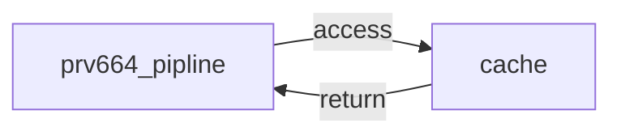
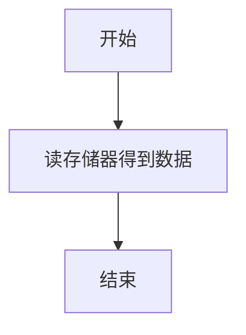
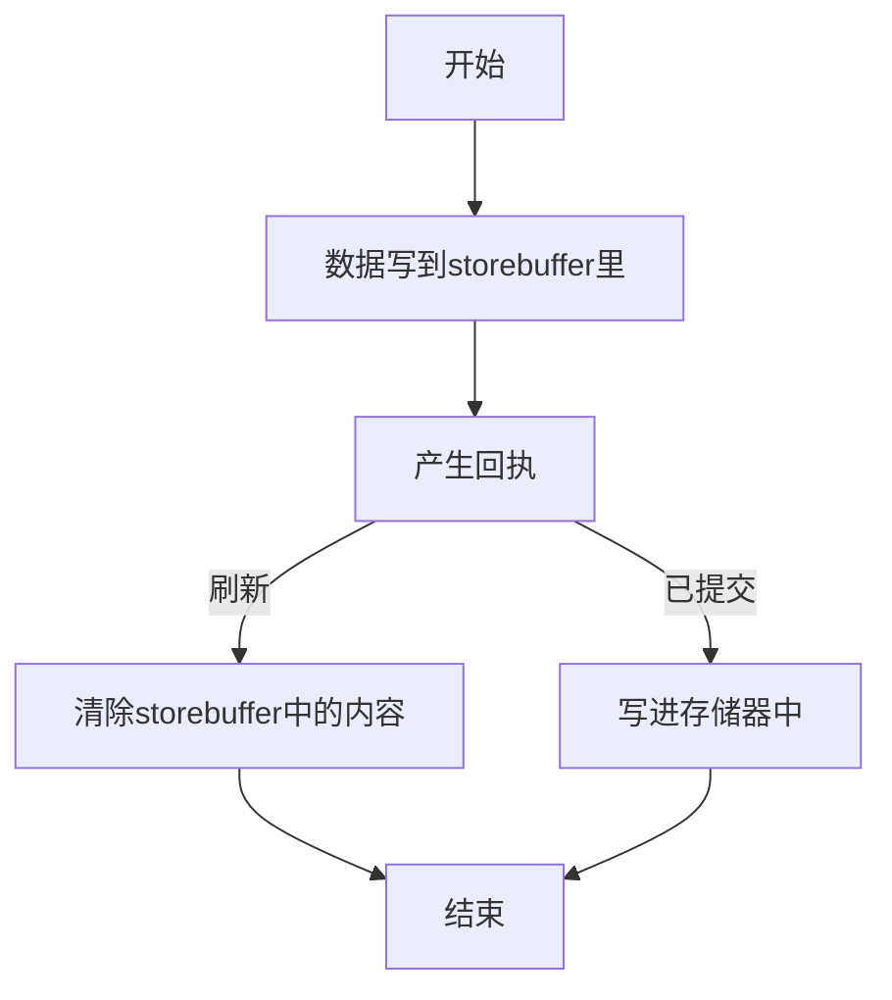
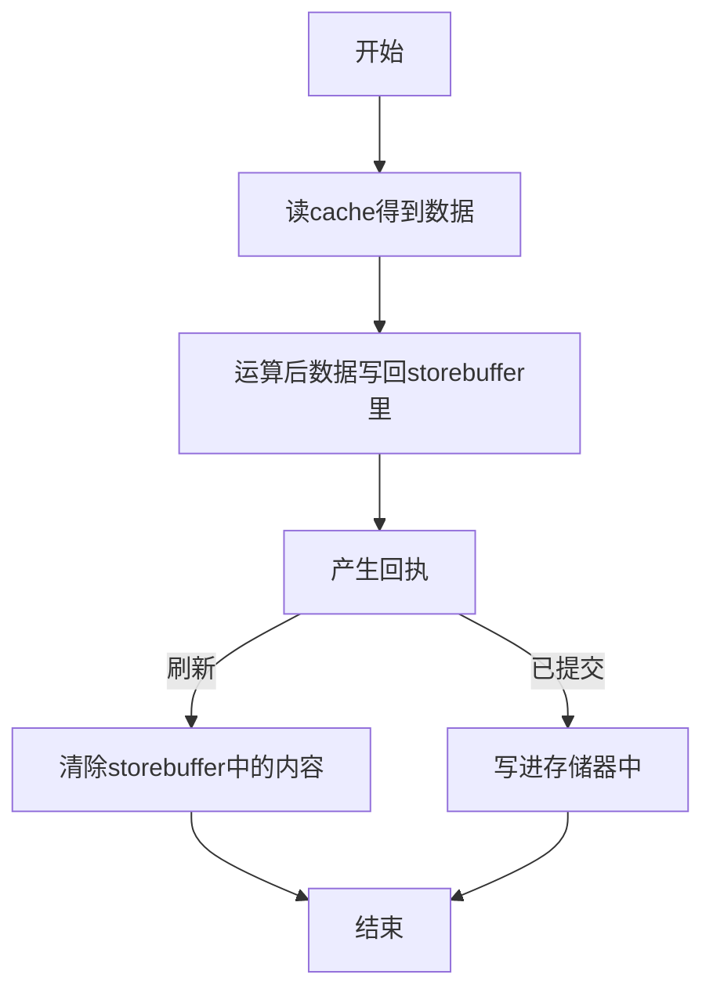

# Cache文档
本文档中主要描述L1缓存的行为，L1缓存是紧耦合于核心的存储器，因此在设计上有很多迁就于流水线的设计。PRV664的流水线与L1缓存的接口一脉相承于PRV564，他们都是松耦合接口，而且不带有冲刷机制（指访问不会被取消，但是storebuffer里的内容会被取消，见下文）。Cache模块与流水线的连接如下图：

cache的刷新接口为标准的req-ack接口，当pipline请求刷新cache时，会拉高flush_req信号，直到cache刷新完成后使能flush_ack。
## Cache access interface
每一条riscv指令都由5bit opcode（本来是7bit，由于32位指令的低2位固定为2b11，故省略）和funct3 funct7段拼接而成，
在这里不对riscv的存取指令做额外译码，只把opcode和funct段拆出来。

|信号名|位宽|作用|
|--|--|--|
|id|8|访问id|
|addr|PADDR|访问的物理地址|
|wdata|XLEN|访问的数据，右对齐的|
|ci|1|此访问不能被缓存|
|wt|1|此访问需要被写穿|
|opcode|5|访问的opcode，和riscv的opcode是一致的|
|funct|10|访问的funct，是由指令的funct7和funct3拼接而成，高7位为指令funct7，低3位为funct3|
|error|6|前一级访问出现的error|
|valid|1|握手信号|
|full|1|握手信号|

## 指令Cache
指令cache是只读的，因此不存在storebuffer的问题，也不需要在流水线刷新的时候清空正在执行的访问。指令cache处理的opcode如下：

|opcode|funct段|作用|
|--|--|--|
|LOAD|-|读128位值|

## 数据Cache
数据cache需要处理的opcode如下：
|opcode|funct段|作用|
|--|--|--|
|LOAD|无funct7，funct3=size|LOAD指令|
|STORE|无funct7，funct3=size|STORE指令|
|AMO|funct7，funct3均和AMO指令的编码一致|AMO指令|

在riscv中，LOAD和SOTRE指令的funct3段编码为：3b000（8bit），3b001（16bit），3b010（32bit），3b011（64bit），3b100（无符号8位），3b101（无符号16位），3b110（无符号32位），数据cache不需要关心LOAD数据的符号位，在流水线内部已有逻辑处理符号问题。
### storebuffer
L1 DCache相对于L2 Cache最大的特点就是storebuffer，对乱序执行的处理器来说，并不是所有内存操作指令都会被执行。对内存的修改需要等到这条指令真正退休后才能执行，在此之前，这条指令对内存的更改都要存放在storebuffer中。

storebuffer以fifo的形式存放等待提交的对内存的修改，每一项的结构如下表所示（未确认）：
|名称|描述|
|--|--|
|ADDR|地址，要访问的地址|
|DATA|要写的数据|
|SIZE|访问的大小|
|CACHE|是否可以被缓存：1.可缓存。2.不可缓存。|
|STATE|当前项的状态：1.待退休。2.已退休。|
|ITAG|当前访问对应的itag，用于确定是否已退休。|
更新storebuffer中的state有专门的通道：sbmanage_interface，当一条store指令/amo指令退休后，这条指令的itag会从这个接口上发出，时序图如下：
```
clk  :__/---\___/---\___/---\___
valid:__/---------------\_______
itag :--< itag0>< itag1 >-------
ready:（不用）
```

🚨需要注意的是，cache_interface中的访问id和指令itag是不同的，cache可以以访问id为index从itag_table中找到访问id对应的itag。itag_table中存放的itag会在当前访问产生回执后清除。

### LOAD指令执行流程


### STORE指令执行流程

### AMO指令执行流程
比起STORE指令，AMO指令涉及到读-改-写的过程，其过程较为复杂。为了保证AMO指令原子性、正确的执行，将AMO指令的执行拆成两个部分：1、读出数据。2、更改后写回。对于当前版本的cpu来说，还暂时不考虑做多核心，因此AMO指令在执行过程中无需锁定总线。

## 需要注意的问题
1. 数据缓存在访问时应当避免相关性问题，例如先后两条对同一物理地址的访问的指令，应当确保其行为正确。考虑下面操作序列：
```
ST ADDR0, DATA0
LD ADDR0
``` 
1. LD操作拿到的数据应该是DATA0。一种折中的方案是：storebuffer中如果有对内存修改的指令还未退休，后续LD指令就不能执行（参考《超标量处理器设计》）。
2. 每一个访问有且只会产生一个回执，ST指令和AMO指令只有在真正进入storebuffer后，才会产生回执。